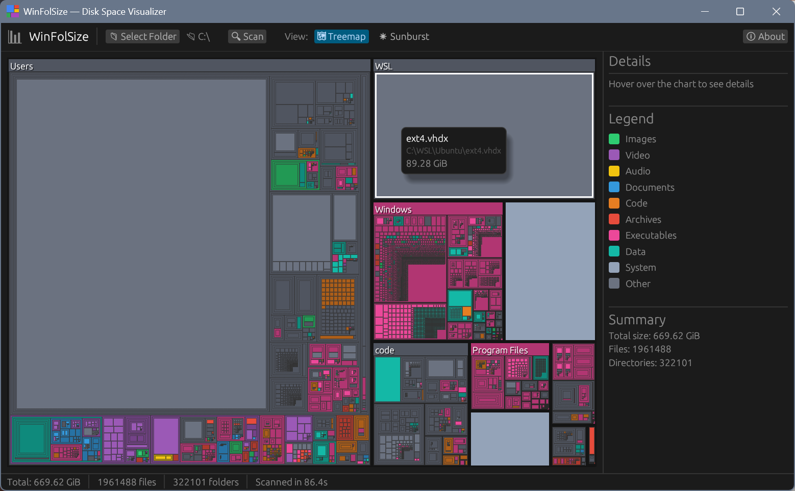

<p align="center">
  <h1 align="center">🗂️ WinFolSize</h1>
  <p align="center">
    <strong>Where did all my disk space go?</strong><br>
    A blazing-fast Windows disk space visualizer built in Rust.
  </p>
</p>

<p align="center">
  <a href="https://github.com/wictorwilen/winfolsize/releases/latest"></a>
  <a href="https://github.com/wictorwilen/winfolsize/actions/workflows/release.yml"></a>
  <a href="LICENSE"></a>
  
  
</p>

---

Scan any folder or drive and instantly see where your disk space is going with interactive **treemap** and **sunburst** visualizations. Powered by [egui](https://github.com/emilk/egui) for a native, GPU-accelerated experience.

<p align="center">
  
</p>

## ✨ Features

- **🟩 Treemap view** — WinDirStat-style rectangles sized proportionally by file/folder size
- **🌀 Sunburst view** — concentric ring chart showing your directory hierarchy at a glance
- **🎨 Color by file type** — images, video, audio, documents, code, archives, and more
- **⚡ Background scanning** — UI stays buttery smooth with real-time progress updates
- **🔍 Drill-down navigation** — click folders to zoom in, back button to navigate out
- **💬 Hover tooltips** — instantly see file name, size, and type
- **📂 Native folder picker** — standard Windows file dialog
- **📊 Sidebar details** — file type legend, summary stats, and hovered item info

## 📦 Installation

### Quick install (one-liner)

**Windows (PowerShell):**

```powershell
irm https://raw.githubusercontent.com/wictorwilen/winfolsize/main/install.ps1 | iex
```

Installs `winfolsize.exe` (GUI) and `winfolsizec.exe` (CLI) into
`%LOCALAPPDATA%\Programs\winfolsize` and adds it to your user `PATH`.

**Linux / macOS / WSL (bash):**

```bash
curl -fsSL https://raw.githubusercontent.com/wictorwilen/winfolsize/main/install.sh | bash
```

Installs `winfolsize` to `~/.local/bin`. Make sure that directory is on
your `PATH` (the script warns you if it isn't).

#### Pin a specific version

```powershell
# PowerShell
& ([scriptblock]::Create((irm https://raw.githubusercontent.com/wictorwilen/winfolsize/main/install.ps1))) -Version v0.1.0
```

```bash
# bash
curl -fsSL https://raw.githubusercontent.com/wictorwilen/winfolsize/main/install.sh | WINFOLSIZE_VERSION=v0.1.0 bash
```

#### Custom install directory

```powershell
# PowerShell — install into C:\Tools\winfolsize instead
& ([scriptblock]::Create((irm https://raw.githubusercontent.com/wictorwilen/winfolsize/main/install.ps1))) -InstallDir 'C:\Tools\winfolsize'
```

```bash
# bash — install into /usr/local instead of ~/.local
curl -fsSL https://raw.githubusercontent.com/wictorwilen/winfolsize/main/install.sh | WINFOLSIZE_PREFIX=/usr/local sudo -E bash
```

### Manual download

Grab a prebuilt archive from the [Releases page](https://github.com/wictorwilen/winfolsize/releases/latest):

| Platform | Asset | Contains |
|----------|-------|----------|
| Windows x64 | `winfolsize-*-windows-x86_64.zip` | `winfolsize.exe` + `winfolsizec.exe` |
| Windows ARM64 | `winfolsize-*-windows-aarch64.zip` | `winfolsize.exe` + `winfolsizec.exe` |
| Linux x64 | `winfolsize-*-linux-x86_64.tar.gz` | `winfolsize` |
| Linux ARM64 | `winfolsize-*-linux-aarch64.tar.gz` | `winfolsize` |
| macOS Intel | `winfolsize-*-macos-x86_64.tar.gz` | `winfolsize` |
| macOS Apple Silicon | `winfolsize-*-macos-aarch64.tar.gz` | `winfolsize` |

`SHA256SUMS.txt` next to the assets contains checksums for every file.

On Windows the zip ships **two** binaries:
- `winfolsize.exe` — GUI launcher (no console window on double-click).
- `winfolsizec.exe` — CLI for use in `cmd`/PowerShell/terminals.

Extract and run whichever you need.

### From source

```bash
cargo install --git https://github.com/wictorwilen/winfolsize --locked
```

## 🚀 Usage

### GUI

Launch `winfolsize` with no arguments to open the GUI, then:

1. Click **Select Folder** to choose a drive or directory
2. Click **Scan** to analyze disk usage
3. Toggle between **Treemap** and **Sunburst** views
4. Click on folders to drill in, use **Back** to navigate up
5. Hover over items to see details in the sidebar and tooltip

> On Linux/WSL the GUI requires a working display server (X11, Wayland,
> or WSLg). Headless environments can still use the CLI.

### CLI

> **Windows users:** use `winfolsizec.exe` for the CLI. The default
> `winfolsize.exe` is a GUI-subsystem binary, so when invoked from
> `cmd`/PowerShell the shell doesn't wait for it and CLI output appears
> *after* the prompt. `winfolsizec.exe` is the same code linked as a
> console app and behaves normally. Both ship in the same zip.
> On Linux/macOS just use `winfolsize`.

Any arguments switch into CLI mode.

```text
winfolsizec scan <PATH> [OPTIONS]    List largest files and/or folders   (Windows)
winfolsize  scan <PATH> [OPTIONS]    Same, on Linux/macOS
winfolsizec delete   [OPTIONS]       Read paths from stdin and delete them
winfolsizec --help                   Show all options
```

Scan options: `-f/--files N`, `-d/--folders N`, `-n/--top N`,
`--bytes`, `--paths-only`, `-0/--null`, `--json`.

Delete options: `--recycle` (default), `--permanent`, `-y/--yes`,
`-0/--null`, `--dry-run`. `--recycle` uses the Windows Recycle Bin or
the XDG/macOS trash via the [`trash`](https://crates.io/crates/trash)
crate, so deletions are reversible.

**Examples:**

```bash
# 20 largest files under D:\
winfolsize scan D:\ --files 20

# 10 largest folders under /var, machine-readable bytes
winfolsize scan /var -d 10 --bytes

# Pipe straight into delete (sizes are stripped automatically)
winfolsize scan ~/Downloads -f 5 | winfolsize delete --recycle

# NUL-safe pipeline with xargs interop
winfolsize scan ./build -f 50 -0 --paths-only | xargs -0 -I{} echo "would zap {}"

# JSON for scripting
winfolsize scan . -n 5 --json | jq '.files[].path'
```

## 📦 Publishing to winget

To make `winget install Wictorwilen.WinFolSize` work, submit a manifest
to [microsoft/winget-pkgs](https://github.com/microsoft/winget-pkgs).
Easiest path uses [`wingetcreate`](https://github.com/microsoft/winget-create):

1. **Publish a GitHub Release** so the Windows `.zip` assets and
   `SHA256SUMS.txt` are available at a stable URL.
2. **Install wingetcreate** (one-time):
   ```powershell
   winget install Microsoft.WingetCreate
   ```
3. **Generate the manifest** for a new package:
   ```powershell
   wingetcreate new https://github.com/wictorwilen/winfolsize/releases/download/vX.Y.Z/winfolsize-X.Y.Z-windows-x86_64.zip
   ```
   `wingetcreate` will prompt for metadata and download the asset to
   compute SHA256. Suggested values:
   - **PackageIdentifier**: `Wictorwilen.WinFolSize`
   - **PackageName**: `WinFolSize`
   - **Publisher**: `Wictor Wilén`
   - **License**: `MIT`
   - **ShortDescription**: `Disk space visualizer with treemap and sunburst views`
   - **Tags**: `disk-space`, `visualizer`, `treemap`, `rust`
   - **InstallerType**: `zip` with a `NestedInstallerFiles` entry
     pointing at `winfolsize.exe` (PortableCommandAlias: `winfolsize`).
   - Add a second `Installers:` entry for the ARM64 zip.
4. **Submit the PR** — `wingetcreate submit --token <gh-pat>` opens a
   pull request against `microsoft/winget-pkgs`.
5. **For subsequent releases** use:
   ```powershell
   wingetcreate update Wictorwilen.WinFolSize --version X.Y.Z \
     --urls https://github.com/wictorwilen/winfolsize/releases/download/vX.Y.Z/winfolsize-X.Y.Z-windows-x86_64.zip `
            https://github.com/wictorwilen/winfolsize/releases/download/vX.Y.Z/winfolsize-X.Y.Z-windows-aarch64.zip \
     --submit --token <gh-pat>
   ```
   This can be wired into the release workflow with the
   [`vedantmgoyal9/winget-releaser`](https://github.com/vedantmgoyal9/winget-releaser)
   action so every GitHub Release automatically opens a winget PR.

Winget requirements to remember:
- The publisher/package identifier must be globally unique and stable
  (`Publisher.Package` casing matters).
- All installer URLs must be HTTPS and reachable without auth.
- SHA256 must match the released archives exactly — do not re-cut a
  release with the same tag after submission.
- A package icon (`.ico`/`.png`) is optional but recommended for
  installer metadata.

## 🎨 File Type Categories

| Color | Category | Extensions |
|-------|----------|------------|
| 🟢 Green | Images | .jpg, .png, .gif, .bmp, .svg, ... |
| 🟣 Purple | Video | .mp4, .mkv, .avi, .mov, ... |
| 🟡 Yellow | Audio | .mp3, .flac, .wav, .ogg, ... |
| 🔵 Blue | Documents | .pdf, .docx, .xlsx, .txt, ... |
| 🟠 Orange | Code | .rs, .py, .js, .ts, .c, ... |
| 🔴 Red | Archives | .zip, .7z, .tar, .gz, .rar, ... |
| 🩷 Pink | Executables | .exe, .dll, .msi, ... |
| 🩵 Teal | Data | .json, .xml, .csv, .db, ... |
| ⚪ Slate | System | .sys, .ini, .reg, .log, ... |
| ⬜ Gray | Other | Everything else |

## 🛠️ Building from Source

### Prerequisites

- [Rust](https://rustup.rs/) 1.85 or later
- [Visual Studio Build Tools](https://visualstudio.microsoft.com/visual-cpp-build-tools/) with C++ workload

### Build

```bash
cargo build --release
```

### Cross-compile for ARM64

```bash
rustup target add aarch64-pc-windows-msvc
cargo build --release --target aarch64-pc-windows-msvc
```

The binary will be in `target/release/winfolsize.exe` (or `target/<target>/release/`).

## 🤝 Contributing

Contributions are welcome! Feel free to open issues and pull requests.

1. Fork the repository
2. Create your feature branch (`git checkout -b feature/amazing-feature`)
3. Commit your changes (`git commit -m 'Add amazing feature'`)
4. Push to the branch (`git push origin feature/amazing-feature`)
5. Open a Pull Request

## 📄 License

This project is licensed under the MIT License — see the [LICENSE](LICENSE) file for details.

---

<p align="center">
  Made with ❤️ and 🦀 by <a href="https://www.wictorwilen.se">Wictor Wilén</a>
</p>
